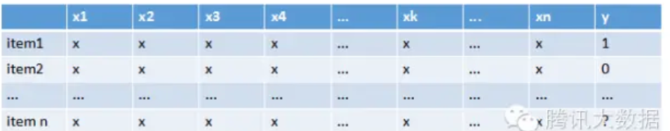
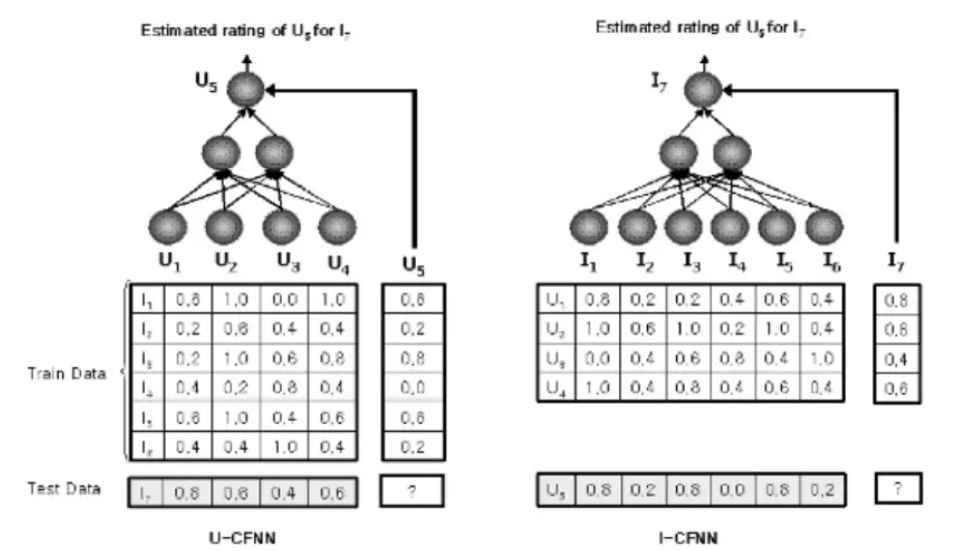

# 推荐系统概览

## 1. 基于流行度推荐
1. 热榜推荐 
## 2. 协同滤波(Collaborative Filtering)
### 2.1 基本分类
1. User-based CF 
    + 分析用户对item的评价（通过浏览记录，购买记录等）
    + 依据用户对item的评价算出所有用户之间的相似度
    + 选出与当前用户最相似的N个用户
    + 将这N个用户评价最高且当前用户又没有浏览过的item推荐给当前用户
2. Item-based CF
	+ 分析各个用户对item的浏览记录
	+ 根据浏览记录分析出所有item之间的相似度
    + 对于当前用户评价最高的item，找出与之相似度最高的N个item
    + 将这N个item推荐给用户

### 2.2 协同滤波存在的问题
+ 过于依赖准确的用户评分
+ 大热的物品更容易被推荐，冷门的物品无人问津
+ 冷启动问题，新用户，新产品
+ 对于item生存周期短（新闻、广告），无人评价，造成评分矩阵稀疏，不利于推荐这些内容

## 3. 基于内容的推荐算法
1. 分类出话题，利用word2vec等，给用户推荐同种话题的东西
2. 缺点是缺少多样性

## 4. 基于模型的算法
+ 比如用logistics回归预测：表格中item 1-n为不同的商品，x 1-n是不同的用户属性，训练的就是属性的权重，权重越大说明该属性对于用户选择商品越重要，y是用户买还是没买商品。有时单个属性如年龄对购买护肤品并不呈强关联，但组合起来年龄+性别+收入属性之后，称之为交叉属性，这个组合属性就对结果产生了强关联。

## 5. CF+神经网络
+ 利用协同过滤和神经网络的过程如下图所示，目的是预测一个用户对于一个新物品的评分：

